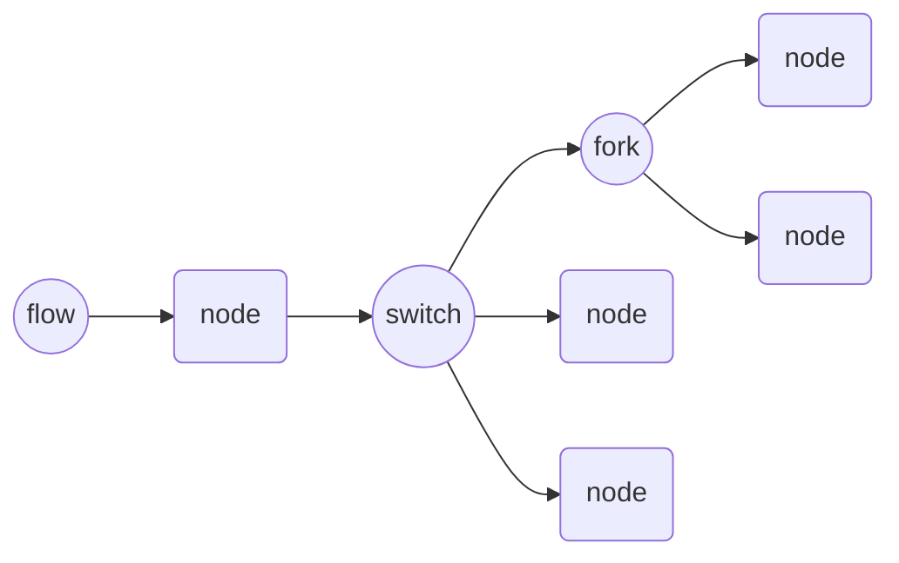

# uflow



## Basic example

```cpp
#include "uflow.hpp"

struct Node : uflow::INode<int&> {
    bool operator()(int& i) override {
        i--;
        return (i > 0);
    }
};

int main() {

    uflow::Flow<int&> flow;

    Node n1, n2, n3;

    flow >> n1 >> n2 >> n3;

    flow(4);

    return 0;
}
```

## Fork & Switch

```cpp
#include "uflow.hpp"

struct TextNode : uflow::INode<> {
    TextNode(std::string_view inText) : mText(inText) {}
    bool operator()() override {
        std::cout << mText << std::endl;
        return true;
    }
    std::string_view mText;
};

int main() {

    uflow::Flow flow, flow2;

    TextNode my("My");
    TextNode name("name");
    TextNode is("is");
    TextNode john("John");

    TextNode your("Your");
    TextNode jack("Jack");

    TextNode question("?");
    TextNode exclam("!");

    uflow::Switch<2> sw;

    flow >> my >> name;
    flow2 >> your >> name;

    name >> is >> sw;

    sw[0] >> jack;
    sw[1] >> john;

    uflow::Fork<2> fork;

    john >> fork;

    fork[0] >> question;
    fork[1] >> exclam;

    sw.select(0);
    flow(); // "My name is jack"

    sw.select(1);
    flow2(); // "Your name is john?!"

    return 0;
}
```