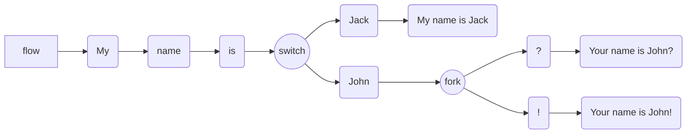

 [](LICENSE)

# uflow

Lightweight C++ nodal library for microcontrollers.

- single-header
- no heap allocation
- platform independent




## Basic example

```cpp
#include "uflow.hpp"

struct Node : uflow::INode<int&> {

    bool operator()(int& i) override {

        i /= 2;

        std::cout << i << std::endl;

        // returning false will stop the flow execution
        return (i > 0);
    }

};

int main() {

    uflow::Flow<int&> flow;

    Node n1, n2, n3, n4, n5;

    flow >> n1 >> n2 >> n3 >> n4 >> n5;

    flow(6); // prints 3, 1, 0

    return 0;
}
```

## Switch & Fork

If it's possible to connect several outputs to one node input,
it's not possible to connect an ouput to several node inputs.
This library provides a switch and a fork type that allows to do complex routings.
The switch allows to select a flow among others and the fork separates the flow into several ones.

```cpp
#include "uflow.hpp"

struct TextNode : uflow::INode<> {
    TextNode(std::string_view inText) : mText(inText) {}
    bool operator()() override {
        // only prints the text it has been constructed with
        std::cout << mText;
        return true;
    }
    std::string_view mText;
};

int main() {

    uflow::Flow flow, flow2;

    TextNode my("My ");
    TextNode name("name ");
    TextNode is("is ");
    TextNode john("John");

    TextNode your("Your ");
    TextNode jack("Jack");

    TextNode newLine("\n");
    TextNode question("?");
    TextNode exclamation("!");

    uflow::Switch<2> sw;

    flow >> my >> name >> is >> sw; // connects to the switch

    flow2 >> your >> name;

    sw[0] >> jack; // route one output of the switch to a node
    sw[1] >> john; // and the other output the an other one

    jack >> newLine;

    uflow::Fork<2> fork;

    john >> fork; // connects to the fork

    fork[0] >> question; // route the fork
    fork[1] >> exclamation;

    sw.select(0); // select the first ouput of the switch
    flow(); // prints "My name is jack"

    sw.select(1); // select the second output of the switch
    flow2(); // prints "Your name is john?!"

    return 0;
}
```